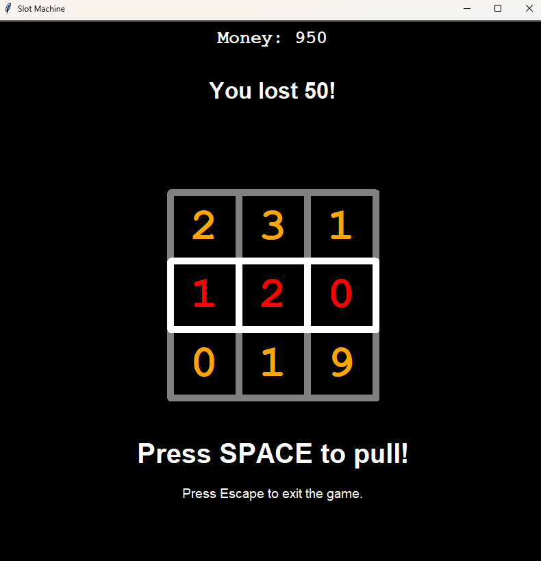

# Slot Machine Simulation

This is my first major project using Python classes and the Turtle module for graphics.

## Project Overview

This project showcases:

- **Object-Oriented Programming (OOP):** Utilizes classes to model different components of the slot machine.
- **Graphical User Interface (GUI):** Implements a graphical user interface using Turtle graphics.
- **Game Mechanics:** Simulates basic slot machine operations without real money involvement.

## Showcase

## Important Notes

- **Educational Use Only**: This simulation is intended solely for educational purposes. It does not involve real money gambling and is designed to help learners understand programming concepts and basic game mechanics.
