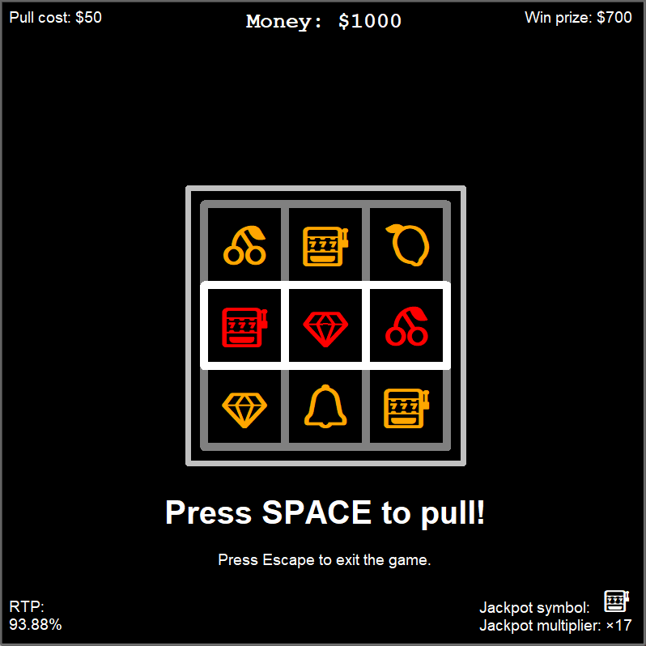

# Slot Machine Simulation

This is my first major project using Python classes and the Turtle module for graphics.

## Project Overview

This project showcases:

- **Object-Oriented Programming (OOP):** Utilizes classes to model different components of the slot machine.
- **Graphical User Interface (GUI):** Implements a graphical user interface using Turtle graphics.
- **Game Mechanics:** Simulates basic slot machine operations without real money involvement.
- **Logging:** Logs game actions and outcomes to text files in simple or detailed mode.
- **Configuration:** Allows easy customization of game parameters through a configuration file.
- **Error Handling:** Implements validation to ensure proper configuration settings.
- **Cross-Platform Compatibility:** Includes scripts for running the game on both Windows and Unix-based systems.

## Game Showcase


## Installation Instructions

To set up and run this project locally, follow these steps:

### Prerequisites

- Ensure you have [Python](https://www.python.org/downloads/) version 3.12 or higher installed on your machine.
- Ensure you have [pip](https://pip.pypa.io/en/stable/) installed for managing Python packages.

### Install Dependencies

- Ensure you have Python 3.12 and the Turtle module installed. Turtle is usually included with Python, but if you encounter any issues, you can install it via pip:
```bash
pip install PythonTurtle
```

### Clone the Repository

Clone this repository to your local machine using:

```bash
git clone https://github.com/juritox/slot-machine.git
```

## Running the Game

- **Windows Instructions:** Simply navigate to the project directory and run the `run_game_windows.bat` script.

- **Unix-based Systems Instructions:** Navigate to the project directory, ensure the `run_game_unix.sh` script is executable, and run it.

- If the scripts fail to run the game you can run it directly inside the `src` directory and running `main.py`.

### Modifying Game Settings

- To customize how the game operates and adjust its basic settings, you can modify the `config.py` file located in the `src` directory.

- **Validation:** Some values in `config.py` are validated when starting the game to ensure they are not set incorrectly. Any errors or issues will be logged to the console.

- **Advanced Configuration:** Modifying the configuration is intended for advanced users. It is recommended to use an Integrated Development Environment (IDE) for Python when making changes. Proceed with caution to avoid misconfigurations that might affect game functionality.

## Project Structure

- `src/:` Contains the main Python scripts for the game.
- `assets/:` Includes gifs and icons used in the game.
- `logs/:` Directory where game logs are stored.

## Key Features

- Customizable slot symbols and numbers
- Adjustable win conditions and amounts
- Jackpot functionality
- Calculation of Return To Player (RTP)
- Detailed logging for game events
- Cross-platform compatibility

## License

This project is open source and available under the MIT license.

## Important Notes

**Educational Use Only**: This simulation is intended solely for educational purposes. It does not involve real money gambling and is designed to help learners understand programming concepts and basic game mechanics.
