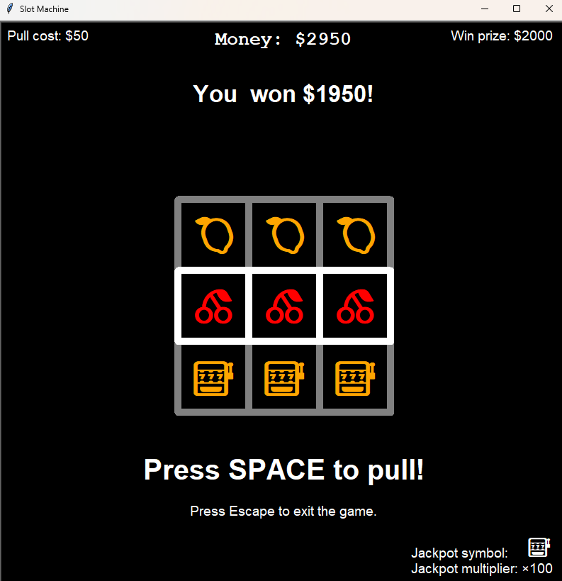
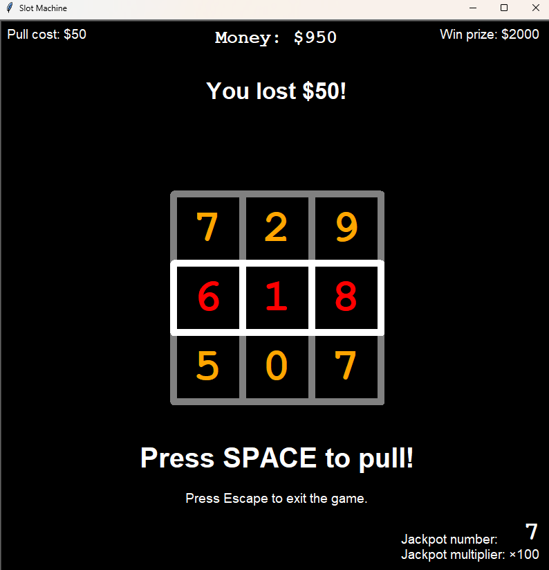

# Slot Machine Simulation

This is my first major project using Python classes and the Turtle module for graphics.

## Project Overview

This project showcases:

- **Object-Oriented Programming (OOP):** Utilizes classes to model different components of the slot machine.
- **Graphical User Interface (GUI):** Implements a graphical user interface using Turtle graphics.
- **Game Mechanics:** Simulates basic slot machine operations without real money involvement.
- **Logging:** Logs game actions and outcomes to text files in simple or detailed mode.

## Game Showcase




## Installation Instructions

To set up and run this project locally, follow these steps:

### Prerequisites

- Ensure you have [Python](https://www.python.org/downloads/) version 3.12 or higher installed on your machine.
- Ensure you have [pip](https://pip.pypa.io/en/stable/) installed for managing Python packages.

### Clone the Repository

Clone this repository to your local machine using:

```bash
git clone https://github.com/juritox/slot-machine.git
```

## Important Notes

- **Educational Use Only**: This simulation is intended solely for educational purposes. It does not involve real money gambling and is designed to help learners understand programming concepts and basic game mechanics.
